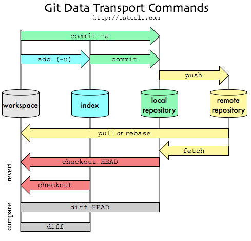

## 단축키

|          명령어          |            액션             |
| :----------------------: | :-------------------------: |
|       `git status`       |       git local 상황        |
|        `git add`         |     stage에 파일 올리기     |
| `git commit -m "메시지"` | 스테이지에 올린 것들을 커밋 |
|        `git push`        |       remote로 올리기       |
|        `git log`         |        log 상황 보기        |
|   `git commit --amend`   |   현재 커밋 상태에 올리기   |
|      `git restore`       |  스테이지 올린 것 되돌리기  |
|       `git reset`        |     커밋에 올린 것 취소     |

|   git data transport commands   |
| :-----------------------------: |
|  |

## 깃 사용 순서

1. `git add [파일명, 폴더명]`
   > 파일 및 폴더 스테이지에 올리기
2. `git status`
   > 스테이지 상황 체크
3. `git commit -m "메시지"`
   > local로 파일 올리기
4. `git push`
   > remote로 올리기
5. `git log`
   > log 확인, 필수적인것.
