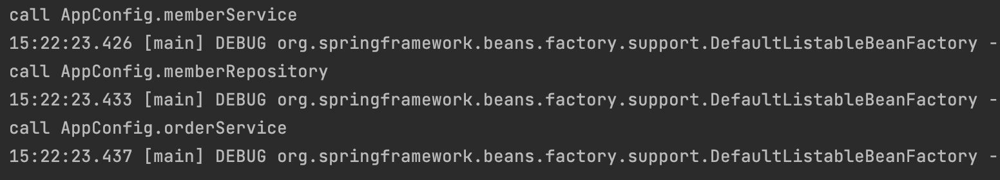

## [싱글톤 패턴이란?](https://github.com/jki503/DesignPattern/blob/main/doc/singleton.md)

</br>

### 싱글톤에서 stateful 하는 경우

ex)

- 나의 id에 다른 사람의 이름이 찍히는 문제..
- 나의 결제 내역에서 다른 사람의 결제 내역..

</br>

> 실무에서 이 경우 로그를 다 뒤져봐야해서 복구하는 것만 몇 달이 걸림.

</br>

### 싱글톤 패턴 문제점

</br>

> - 구현 코드 자체가 많음
> - 의존 관계상 클라이언트가 구체 클래스 의존 -> `DIP 위반`
> - 구체 클래스에 의존 -> `OCP 위반` 가능성 높음
> - 전역적으로 사용하기 때문에 `단위 테스트 어려움`
> - 내부 속성 변경 및 초기화 어려움
> - private 생성자로 `자식 클래스 만들기 어려움`
> - 유연성이 떨어짐

</br>
</br>

## 싱글톤 컨테이너

</br>

> - 싱글턴 패턴을 적용 하지 않아도, 객체 인스턴스를 싱글톤으로 관리
> - `스프링 컨테이너`는 `싱글톤 컨테이너 역할`
> - 싱글톤 객체 생성 및 관리하는 기능 `싱글톤 레지스트리`

### 스프링 컨테이너에서 싱글톤에서의 문제 해결

</br>

> - 싱글톤 패턴 위한 코드 필요X -> 개발자가 신경 쓸 코드 줄어듦
> - DIP, OCP, 단위 테스트, private 생성자로부터 자유로움

```java
@Configuration
public class AppConfig {

    @Bean //Resister to the Spring container
    public MemberService memberService(){
        System.out.println("call AppConfig.memberService");
        return new MemberServiceImpl(memberRepository());
    }

    @Bean
    public MemberRepository memberRepository() {
        System.out.println("call AppConfig.memberRepository");
        return new MemoryMemberRepository();
    }

    @Bean
    public OrderService orderService(){
        System.out.println("call AppConfig.orderService");
        return new OrderServiceImpl(memberRepository(), discountPolicy());
    }

    @Bean
    public DiscountPolicy discountPolicy(){
//      return new FixDiscountPolicy();
        return new RateDiscountPolicy();
    }
}
```

- memberService 빈에서 `memberRepository()` 호출
  - 이 메서드에서 `new MemoryMemberRepository()` 호출
- orderService 빈에서 `memberRepository()` 호출
  - 이 메서드에서 `new MemoryMemberRepository()` 호출

> ! 각각 다른 2개의 `MemoryMemberRepository` 생성되면서 싱글톤이 깨지는 것처럼 보임

</br>

#### TEST

</br>

- 순수 자바코드에서 예상
  - call appconfig.memberService 순서보장 X
  - call appconfig.memberRepository 순서보장 X
  - call appconfig.memberRepository 순서보장 X
  - call appconfig.orderService 순서보장 X
  - call appconfig.memberRepository 순서보장 X

</br>

- 결과
  

</br>

### @Configuration과 바이트코드 조작

```java

 AnnotationConfigApplicationContext(AppConfig.class)
```

- AnnotationConfigApplicationContext의 파라미터를 빈에 등록 -> AppConfig도 빈에 등록

> - 따라서, 스프링 컨테이너에서 AppConfig도 순수한 class가 아닌 AppConfig@CGLIB로 등록
>   - CGLIB는 스프링이 바이트 조작 라이브러리 사용
>   - bean에 등록 되어 있으면 반환
>   - bean 없으면 생성하고 반환

</br>

#### @Configuration을 등록하지 않으면?

> @Bean만 사용해도 스프링 빈 등록, but 싱글톤 보장 x
> @Configuration은 싱글톤을 위해 존재.
